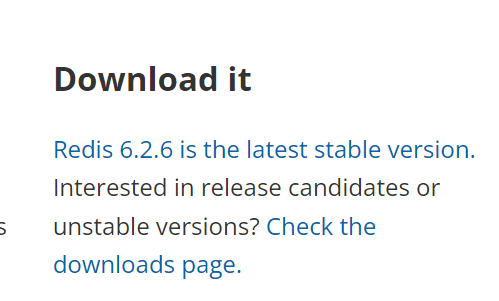
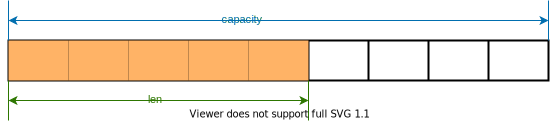

# 安装

1. 前往[redis](https://redis.io/)官网下载redis源码。
   
2. 安装C语言的编译环境：`sudo apt install gcc make`
3. 解压下载的源码：`tar -xf redis-6.2.6.tar.gz`
4. 进入源码目录：`cd redis-6.2.6/`
5. 编译源码：执行`make`
6. 安装redis：执行`sudo make install`

# 启动

1. 复制源码根目录下的redis.conf文件到/etc目录：`sudo cp redis.conf /etc`
2. 修改/etc目录中的redis.conf文件： `sudo vim /etc/redis.conf`，将文件中的daemonize no 改为 yes,然后保存。
3. 启动redis-server：`redis-server /etc/redis.conf`
4. 查看redis-server的进程，确认其成功启动： `ps -ef | grep redis`
   看到如下的信息说明redis已经成功启动：

   ``` none
   lqm      27237     1  0 10:27 ?        00:00:00 redis-server 127.0.0.1:6379
   lqm      27243     8  0 10:29 tty1     00:00:00 grep --color=auto redis
   ```

# 连接

1. 使用redis-cli可以连接到redis-server：`redis-cli`
2. 显示redis的终端，说明连接成功。在redis终端中输入ping，redis会返回PONG作为回应。

# 关闭

1. 单实例关闭: `lqm@lqm-win11: redis-cli shutdown`
2. 进入中断后再关闭：`127.0.0.1:6379> shutdown`

# 常见问题

1. 显示中文
    在启动redis-cli时在后面加上--raw参数即可使中文正常显示：`redis-cli --raw`

# Key键操作

1. keys * 查看当前库的所有key
2. exists key 判断某个key是否存在
3. type key 查看key是什么类型
4. del key 删除指定的key数据
5. unlink key 根据value选择非阻塞删除（仅将key从keyspace元数据中删除，真正的删除会在后续异步操作）
6. expire key 10 为给定的key设置10秒钟的过期时间
7. ttl key 查看还有多少秒过期，-1 表示永不过期，-2 表示已经过期。
8. select 切换数据库，select 1 切换到1号库， select 6 切换到6号库。
9. dbsize 查看当前数据库的key的数量
10. flushdb 清空当前库
11. flushall 清空全部库

# 常用数据类型

## String

### String简介

String类型是二进制安全的。意味着redis的String可以包含任何数据，比如jpg图片或者序列化的对象。
String类型是redis最基本的数据类型，一个redis中字符串value最多可以是512M。

### String常用命令

1. **set \<key\> \<value\>** 添加键值对
    示例：

    ``` none
    127.0.0.1:6379> set k1 v100
    OK
    127.0.0.1:6379> set k2 v200
    OK
    127.0.0.1:6379> keys *
    1) "k2"
    2) "k1"
    ```

2. **get \<key\>** 查询对应键值，
   示例：

    ``` none
    127.0.0.1:6379> get k1
    "v100"
    ```

3. **append \<key\> \<value\>** 将给定的\<value\>追加到原值的末尾
    示例：

    ``` none
    127.0.0.1:6379> append k1 c100
    (integer) 8
    127.0.0.1:6379> get k1
    "v100c100"
    ```

4. **strlen \<key\>** 获取值的长度
    示例：

    ``` none
    127.0.0.1:6379> strlen k1
    (integer) 8
    ```

5. **setnx \<key\> \<value\>** 只有在key不存在时才设置key的值
    示例：

    ``` none
    127.0.0.1:6379> setnx k1 k50
    (integer) 0
    127.0.0.1:6379> setnx k3 k50
    (integer) 1
    127.0.0.1:6379> get k1
    "v100c100"
    127.0.0.1:6379> get k3
    "k50"
    ```

6. **incr \<key\>** 将key中存储的数字值增加1，只能对数字值操作，如果为空，新增值为1。
    示例：

    ``` none
    127.0.0.1:6379> set k1 10
    OK
    127.0.0.1:6379> incr k1
    (integer) 11
    127.0.0.1:6379> get k1
    "11"
    127.0.0.1:6379> incr k2
    (integer) 1
    127.0.0.1:6379> get k2
    "1"
    ```

7. **decr \<key\>** 将key中存储的数字值减少1，只能对数字值操作，如果为空，新增值为-1。
    示例：

    ``` none
    127.0.0.1:6379> decr k2
    (integer) 0
    127.0.0.1:6379> get k2
    "0"
    127.0.0.1:6379> decr k3
    (integer) -1
    127.0.0.1:6379> get k3
    "-1"
    ```

8. **incrby/decrby \<key\> \<步长\>** 将key中存储的数字值增减，自定义步长
    示例：

    ``` none
    127.0.0.1:6379> get k1
    "16"
    127.0.0.1:6379> incrby k1 5
    (integer) 21
    127.0.0.1:6379> get k1
    "21"
    127.0.0.1:6379> get k2
    "0"
    127.0.0.1:6379> decrby k2 4
    (integer) -4
    127.0.0.1:6379> get k2
    "-4"
    ```

9. **mset \<key1\> \<value1\> \<key2\> \<value2\> ...** 同时设置一个或多个key-value对
    示例：

    ``` none
    127.0.0.1:6379> mset k1 a k2 b k3 c
    OK
    127.0.0.1:6379> keys *
    1) "k2"
    2) "k3"
    3) "k1"
    ```

10. **mget \<key1\> \<key2\> ...** 同时获取一个或多个value。
    示例：

    ``` none
    127.0.0.1:6379> mget k1 k2 k3
    1) "a"
    2) "b"
    3) "c"
    ```

11. **msetnx \<key1\> \<value1\> \<key2\> \<value2\> ...** 同时设置一个或多个key-value对,当且仅当所有给定的key都不存在。该操作为原子性，有一个失败则都失败。
    示例：

    ``` none
    127.0.0.1:6379> msetnx k1 a k2 b
    (integer) 1
    127.0.0.1:6379> msetnx k1 a k2 b k3 c
    (integer) 0
    127.0.0.1:6379> get k3
    (nil)
    ```

12. **getrange \<key\> \<起始位置\> \<结束位置\>** 获取值的范围,包含起始位置，也包含结束位置
    示例：

    ``` none
    127.0.0.1:6379> set k1 0123456789
    OK
    127.0.0.1:6379> getrange k1 3 6
    "3456"
    ```

13. **setrange \<key\> \<起始位置\> \<value\>** 用\<value\>覆写\<key\>所存储的字符串值。从起始位置开始（索引从0开始）
    示例：

    ``` none
    127.0.0.1:6379> set k1 11111
    OK
    127.0.0.1:6379> setrange k1 3 22
    (integer) 5
    127.0.0.1:6379> get k1
    "11122"
    ```

14. **setex \<key\> \<过期时间\> \<value\>** 设置键值的同时，设置过期时间，单位秒
    示例：

    ``` none
    127.0.0.1:6379> setex k2 5 100
    OK
    127.0.0.1:6379> get k2
    "100"
    127.0.0.1:6379> get k2
    (nil)
    ```

15. **getset \<key\> \<value\>** 设置了新值同时获得旧值
    示例：

    ``` none
    127.0.0.1:6379> getset k1 18
    "11122"
    127.0.0.1:6379> get k1
    "18"
    ```

### String的数据结构

String的数据结构时简单的动态字符串(Simple Dynamic String,缩写 SDS)。是可以修改的字符串，采用预分配冗余空间的方式来减少内存的频繁分配。



如图所示，内部为当前字符串实际分配的空间capacity一般要高于实际字符串长度len。当字符串长度小于1M时，扩容都是加倍现有的空间，如果超过1M，扩容一次只会多扩1M的空间。需要注意的是字符串最大长度为512M。

## List

### List简介

List就是列表数据结构。
List是单键多值的结构。
Redis的List是简单的字符串列表，按照插入顺序排序。可以在列表的头部或者尾部添加数据。
List的底层实际上是一个双向列表，对两端的操作性能很高，通过索引下标来操作中间的节点性能会较差。


### List常用命令

1. **lpush/rpush \<key1\> \<value1\> \<value2\> \<value3\>** 从左边/右边插入一个或多个值
    从左边插入示例：

    ``` none
    127.0.0.1:6379> lpush k1 v1 v2 v3
    (integer) 3
    ```

    

    从右边插入示例：

    ``` none
    127.0.0.1:6379> rpush k1 v1 v2 v3
    (integer) 3
    ```

    

2. **lpop/rpop \<key\>** 从左边/右边吐出一个值。值在键在，值光键亡。
    示例：

    ``` none
    127.0.0.1:6379> lpop k1
    "v3"
    127.0.0.1:6379> lpop k1
    "v2"
    127.0.0.1:6379> lpop k1
    "v1"
    127.0.0.1:6379> lpop k1
    (nil)
    127.0.0.1:6379> keys *
    (empty array)
    ```

3. **lrange \<key\> \<start\> \<stop\>** 按照索引下标获得元素（从左到右,下标从0开始，从0到-1表示取出所有值）。
    示例：

    ``` none
    127.0.0.1:6379> lpush k1 v1 v2 v3
    (integer) 3
    127.0.0.1:6379> lrange k1 0 2
    1) "v3"
    2) "v2"
    3) "v1"
    ```

4. **lindex \<key\> \<index\>** 按照索引下标获得元素（从左到右）
    示例：

    ``` none
    127.0.0.1:6379> lindex k1 0
    "v3"
    127.0.0.1:6379> lindex k1 1
    "v2"
    127.0.0.1:6379> lindex k1 2
    "v1"
    ```

5. **llen \<key\>** 获取List长度
    示例：

    ``` none
    127.0.0.1:6379> llen k1
    (integer) 3
    ```

6. **linsert \<key\> before \<value\> \<newvalue\>** 在\<value\>后面插入\<newvalue\>
    示例：

    ``` none
    127.0.0.1:6379> linsert k1 before v2 老王
    (integer) 4
    127.0.0.1:6379> lrange k1 0 -1
    v3
    老王
    v2
    v1
    ```

7. **lrem \<key\> \<n\> \<value\>** 从左边删除n个value(从左到右)
    示例：

    ``` none
    127.0.0.1:6379> lpush k1 begin v1 v2 v1 v2 v1 v2 v1 v2 end
    10
    127.0.0.1:6379> lrem k1 2 v1
    2
    127.0.0.1:6379> lrange k1 0 -1
    end
    v2
    v2
    v2
    v1
    v2
    v1
    begin
    ```

8. **lset \<key\> \<index\> \<value\>**将List key下标为\<index\>的值替换成\<value\>
    示例：

    ``` none
    127.0.0.1:6379> lpush k2 v1 v2 v3
    3
    127.0.0.1:6379> lset k2 2 小三
    OK
    127.0.0.1:6379> lrange k2 0 -1
    v3
    v2
    小三
    ```

### List的数据结构

List的数据结构为快速链表quickList。
在列表元素较少的情况下会使用一块连续的内存存储，这个结构是ziplist，也就是压缩列表。
它将所有的元素挨着一起存储，分配的是一块连续的内存。
当数据量比较大的时候才改成quickList。
因为普通的链表需要附加的指针空间太大，会比较浪费空间。比如这个列表里存的只是int类型的数据，结构上还需要额外的指针prev和next。
Redis将链表和ziplist结合起来组成了quickList。也就是将多个ziplist使用双向指针串起来使用。这样既满足了快速的插入删除性能，又不会出现太大的空间冗余。


## Set

### Set简介

Redis set对外提供的功能和List类似，是一个列表的功能，特殊之处在于set是可以自动排重的，当需要存储一个列表数据，又不希望出现重复数据时，set是一个很好的选择。
并且，set提供了判断某个成员是否在一个集合内的重要接口，这个也是list所不能提供的。
Redis的set是string类型的无序集合。它的底层其实是一个value为null的hash表，所以添加、删除、查找的复杂度都是O(1)。
一个算法，随着数据的增加，执行时间的长短，如果是O(1)，数据增加，查找数据的时间不变。

### Set常用命令

1. **sadd \<key\> \<value1\> \<value2\ ...>** 将一个或多个member元素加入到集合key中，已经存在的member元素将被忽略。
    示例：

    ``` none
    127.0.0.1:6379> sadd k1 v1 v2 v3 v5
    4
    ```

2. **smembers \<key\>** 取出该集合的所有值。
    示例：

    ``` none
    127.0.0.1:6379> smembers k1
    v1
    v3
    v5
    v2
    ```

3. **sismember \<key\> \<value\>** 判断集合\<key\>是否含有该\<value\>值，有1，没有0
    示例：

    ``` none
    127.0.0.1:6379> sismember k1 v1
    1
    127.0.0.1:6379> sismember k1 v4
    0
    ```

4. **scard \<key\>** 返回该集合的元素个数
    示例：

    ``` none
    127.0.0.1:6379> scard k1
    4
    ```

5. **srem \<key\> \<value1\> \<value2\> ...** 删除集合中的某个元素。
    示例：

    ``` none
    127.0.0.1:6379> srem k1 v1
    1
    127.0.0.1:6379> smembers k1
    v3
    v5
    v2
    ```

6. **spop \<key\> \<n\>** 从集合中随机吐出\<n\>个值
    示例：

    ``` none
    127.0.0.1:6379> spop k1
    v5
    127.0.0.1:6379> spop k1
    v3
    127.0.0.1:6379> spop k1 3
    v4
    v1
    v2
    ```

7. **srandmember \<key\> \<n\>** 从集合中随机取出\<n\>个值，并且值不会从集合中删除。
    示例：

    ``` none
    127.0.0.1:6379> srandmember k1 2
    v1
    v2
    127.0.0.1:6379> srandmember k1 2
    v5
    v2
    ```

8. **smove \<source\> \<destination\> \<value\>** 将集合中的一个值移动到另一个集合
    示例：

    ``` none
    127.0.0.1:6379> smove k1 k2 v1
    1
    127.0.0.1:6379> smembers k1
    v3
    v4
    v2
    v5
    127.0.0.1:6379> smembers k2
    v1
    ```

9. **sinter \<key1\> \<key2\>** 返回两个集合的交集元素
    示例：

    ``` none
    127.0.0.1:6379> smembers k1
    v3
    v2
    v4
    v5
    127.0.0.1:6379> smembers k2
    v1
    v3
    v2
    127.0.0.1:6379> sinter k1 k2
    v3
    v2
    ```

10. **sunion \<key1\> \<key2\>**  返回两个集合的并集元素
    示例：

    ``` none
    127.0.0.1:6379> sunion k1 k2
    v1
    v3
    v2
    v4
    v5
    ```

11. **sdiff \<key1\> \<key2\>** 返回两个集合的差集元素(\<key1\>中存在但\<key2\>中不存在的元素)
    示例：

    ``` none
    127.0.0.1:6379> sdiff k1 k2
    v5
    v4
    127.0.0.1:6379> sdiff k2 k1
    v1
    ```

### Set的数据结构

Set数据结构是dict字典，字典是用哈希表实现的。
